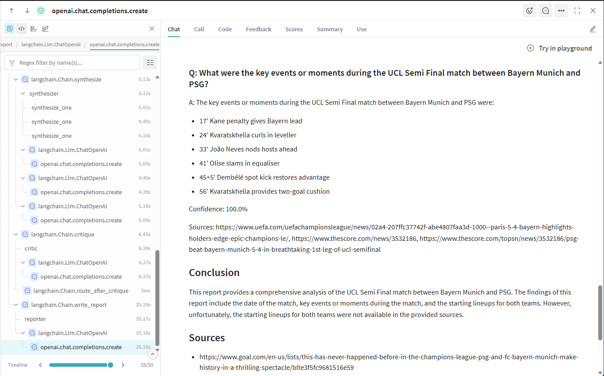
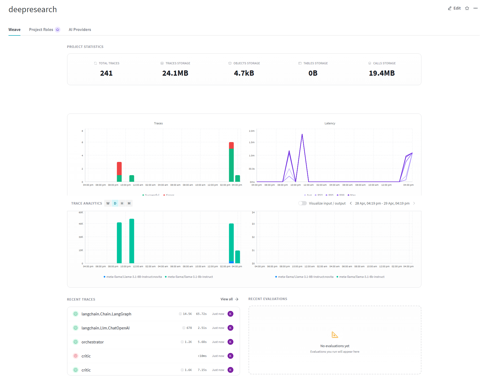
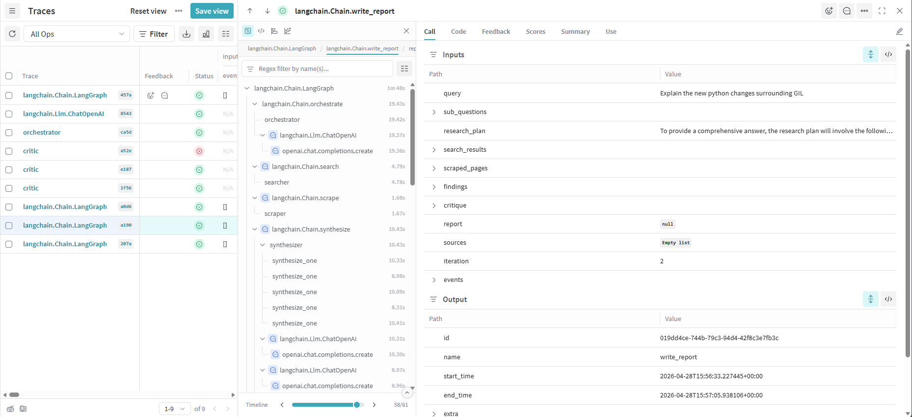

# Deep Research Multi-Agent System

A production-ready multi-agent system that autonomously researches queries by decomposing them, searching sources, scraping content, synthesizing findings, and iteratively validating quality.

**Built with:** Python (Asyncio) | uv (Environment) | LangGraph (Agents) | FastAPI (Backend) | Trafilatura (Web Scraping) | WandB Weave (Observability) | Pydantic (structured I/O) | BM25 (Keyword Retrieval)

## Overview

This system autonomously executes deep research workflows on any query. Given a user question, it systematically:
1. Decomposes the query into researchable sub-questions
2. Searches the web for relevant sources
3. Extracts content from top results
4. Synthesizes structured findings with confidence scores
5. Validates research quality; if gaps exist, loops back to search with refined questions (max N iterations)
6. Reports findings as a formatted markdown document with citations
7. Logs every trace including input, decision, output and system state for observability

Use it for: competitive analysis, technical due diligence, market research, literature reviews, fact-checking, or any task requiring comprehensive web-based research with iterative validation.


## Architecture

```
User Query → Orchestrator (decompose) → Searcher → Scraper → Synthesizer → Critic → Reporter
                                           ↑___________________________________↓
                                           (iterate if gaps found, max N loops)
```

### Langgraph Nodes

- **Orchestrator**: Plans research by decomposing query into 3-5 sub-questions
- **Searcher**: Parallel Tavily API calls with rate limiting
- **Scraper**: Trafilatura-based content extraction from top URLs
- **Synthesizer**: Uses BM25 keyword retrieval to find relevant passages, then LLM generates structured findings (question, answer, confidence, sources)
- **Critic**: Validates sufficiency; triggers re-search if gaps exist
- **Reporter**: Generates final markdown report with citations

## Quick Start

```bash
# Install
uv sync

# Populate environment variables
cp .env.example .env

# Run server
uv run python -m uvicorn app.main:app

# In another terminal: query via HTTP
curl -N -X POST -H "Content-Type: application/json" \
  -d '{"query":"What are the latest advances in quantum error correction?"}' \
  http://localhost:8000/research
```

Returns **SSE stream** of real-time node completions.

## Key Technical Decisions

| Tech | Why |
|----------|-----|
| **`LangGraph`** over custom orchestration | `StateGraph` provides typed state management, conditional routing, automatic persistence for retries |
| **`SSE` streaming** | Real-time updates, single connection, natural fit for agentic workflows |
| **`Pydantic` schemas with Field descriptions** | All agent outputs validated against schema, LLM respects format instructions; Schema descriptions → LLM format instructions (less separate prompt engineering needed) |
| **Parallelism limiting** | `asyncio.Semaphore` prevents API throttling; max 3 Tavily, 5 LLM concurrent calls |
| **`WandB Weave` for observability** | Automatic LLM call tracing + decorator-based function instrumentation; captures all input/output/latency |
| **`BM25` for passage retrieval** | Keyword-based ranking (no embeddings) finds relevant passages per question; faster, no API calls, high lexical recall |

## Testing

```bash
# All tests
uv run pytest tests/ -v

# Unit tests (structured I/O, rate limiting)
uv run pytest tests/unit/ -v

# Integration tests (API contract)
uv run pytest tests/integration/ -v

```

## Project Structure

```
app/
├── agents/          # Orchestrator, Searcher, Scraper, Synthesizer, Critic, Reporter
├── utils/           # LLM wrapper, rate limiting, WandB Weave integration, BM25 retrieval
├── schema.py        # Pydantic models + ResearchState (TypedDict)
├── engine.py        # LangGraph state machine compilation
├── config.py        # Environment variable loading
└── main.py          # FastAPI application + SSE event streaming
tests/
├── unit/            # Structured I/O, Agent Node tests, BM25 retrieval tests
└── integration/     # API endpoint tests, system dry run
```

## Sample Run

Question: "Please explain the recent debacle between Chinas involvement in Metas takeover of Manus AI"

Answer:

```md
# China's Involvement in Meta's Takeover of Manus AI: A Comprehensive Analysis

## Executive Summary

This report provides a comprehensive analysis of China's involvement in Meta's takeover of Manus AI, a US-based AI startup. The report examines the reasons behind China's National Development and Reform Commission (NDRC) blocking the $2 billion acquisition, the implications of China's involvement for the global AI landscape, and the potential risks and consequences of the blocked deal on the global AI market. The report also discusses the key regulatory and compliance issues that arise from China's involvement in Meta's takeover of Manus AI and how these might be addressed.

## Detailed Findings

### Q: What are the specific reasons behind China's National Development and Reform Commission (NDRC) blocking Meta's $2 billion acquisition of Manus AI?

A: The specific reasons behind China's National Development and Reform Commission (NDRC) blocking Meta's $2 billion acquisition of Manus AI are not explicitly stated in the provided sources. However, it is mentioned that the move aligns with Chinese laws and regulations, and is part of a crackdown on US investments in domestic tech companies.

Confidence: 60.0%

Sources: https://beam.ai/agentic-insights/china-blocks-meta-manus-ai-agent-acquisition-enterprise-impact, https://fortune.com/2026/04/28/china-blocks-meta-manus-deal-ai/, https://www.theguardian.com/world/2026/apr/27/china-blocks-meta-takeover-manus-ai-agent-developer, https://techresearchonline.com/news/meta-manus-acquisition-blocked-china-ai-talent-protection/, https://www.peoplematters.in/news/ai-and-emerging-tech/china-blocks-metas-ai-deal-signals-stricter-control-over-tech-investments-49426

### Q: How does China's involvement in Meta's takeover of Manus AI affect the global AI landscape in terms of data security and intellectual property?

A: China's involvement in Meta's takeover of Manus AI affects the global AI landscape by protecting its AI talent and intellectual property, thereby changing the risk calculus for businesses and investors in the US-China tech race, particularly in terms of data security and intellectual property.

Confidence: 90.0%

Sources: https://techresearchonline.com/news/meta-manus-acquisition-blocked-china-ai-talent-protection/, https://www.cnbc.com/2026/04/28/china-blocks-meta-manus-deal-ai-tech-rivalry.html, https://www.cnbc.com/2026/04/28/china-meta-manus-ai-deal.html, https://beam.ai/agentic-insights/china-blocks-meta-manus-ai-agent-acquisition-enterprise-impact, https://www.theguardian.com/world/2026/apr/27/china-blocks-meta-takeover-manus-ai-agent-developer

### Q: What are the potential implications of China's involvement in Manus AI for the US and other Western countries, and how might they respond?

A: The potential implications of China's involvement in Manus AI for the US and other Western countries include increased regulatory barriers, decoupling of AI ecosystems, and a clash over code and control. The US and other Western countries might respond by seeking to maintain control of strategic technologies, preventing them from leaking to China, and potentially imposing stricter regulations on foreign acquisitions in AI.

Confidence: 80.0%

Sources: https://www.peoplematters.in/news/ai-and-emerging-tech/china-blocks-metas-ai-deal-signals-stricter-control-over-tech-investments-49426, https://www.straitstimes.com/business/companies-markets/can-china-really-block-metas-manus-ai-acquisition, https://m.economictimes.com/news/international/business/shots-fired-in-the-ai-war-us-and-china-clash-over-code-and-control/articleshow/130558097.cms, https://www.straitstimes.com/business/companies-markets/can-china-really-block-metas-manus-ai-acquisition, https://fortune.com/2026/04/28/china-blocks-meta-manus-deal-ai/

### Q: What are the key regulatory and compliance issues that arise from China's involvement in Meta's takeover of Manus AI, and how might these be addressed?

A: The key regulatory and compliance issues that arise from China's involvement in Meta's takeover of Manus AI include China's rules that would require Chinese AI companies to get approval before seeking US investment in funding rounds, and the chilling effect on China's AI startup scene. These issues might be addressed by understanding the geopolitical implications of AI investments and seeking approval from relevant authorities.

Confidence: 80.0%

Sources: https://beam.ai/agentic-insights/china-blocks-meta-manus-ai-agent-acquisition-enterprise-impact, https://fortune.com/2026/04/28/china-blocks-meta-manus-deal-ai/, https://www.cnbc.com/2026/04/28/china-meta-manus-ai-deal.html, https://www.cnn.com/2026/04/27/tech/china-blocks-meta-manus-intl-hnk

### Q: What are the potential risks and consequences of the blocked deal on the global AI market, and how might this impact US and Western companies' access to Chinese AI talent and technologies?

A: The blocked deal may lead to increased regulatory barriers for foreign acquisitions in AI, especially where ownership or access to technology could have strategic implications. This could impact US and Western companies' access to Chinese AI talent and technologies, as China expands its domestic pipeline of AI engineers and encourages overseas researchers to return. The intensifying global race in artificial intelligence may lead to a decoupling of the US and Chinese AI ecosystems, with both countries seeking to maintain control of strategic technologies.

Confidence: 80.0%

Sources: https://www.peoplematters.in/news/ai-and-emerging-tech/china-blocks-metas-ai-deal-signals-stricter-control-over-tech-investments-49426, https://fortune.com/2026/04/28/china-blocks-meta-manus-deal-ai/, https://m.economictimes.com/news/international/business/shots-fired-in-the-ai-war-us-and-china-clash-over-code-and-control/articleshow/130558097.cms, https://www.peoplematters.in/news/ai-and-emerging-tech/china-blocks-metas-ai-deal-signals-stricter-control-over-tech-investments-49426, https://www.cnbc.com/2026/04/28/china-blocks-meta-manus-deal-ai-tech-rivalry.html

## Conclusion

China's involvement in Meta's takeover of Manus AI has significant implications for the global AI landscape, including data security and intellectual property. The blocked deal may lead to increased regulatory barriers for foreign acquisitions in AI, and impact US and Western companies' access to Chinese AI talent and technologies. The intensifying global race in artificial intelligence may lead to a decoupling of the US and Chinese AI ecosystems, with both countries seeking to maintain control of strategic technologies.

## Sources

* https://beam.ai/agentic-insights/china-blocks-meta-manus-ai-agent-acquisition-enterprise-impact
* https://fortune.com/2026/04/28/china-blocks-meta-manus-deal-ai/
* https://www.theguardian.com/world/2026/apr/27/china-blocks-meta-takeover-manus-ai-agent-developer
* https://techresearchonline.com/news/meta-manus-acquisition-blocked-china-ai-talent-protection/
* https://www.peoplematters.in/news/ai-and-emerging-tech/china-blocks-metas-ai-deal-signals-stricter-control-over-tech-investments-49426
* https://www.cnbc.com/2026/04/28/china-blocks-meta-manus-deal-ai-tech-rivalry.html
* https://www.cnbc.com/2026/04/28/china-meta-manus-ai-deal.html
* https://www.cnn.com/2026/04/27/tech/china-blocks-meta-manus-intl-hnk
* https://www.straitstimes.com/business/companies-markets/can-china-really-block-metas-manus-ai-acquisition
* https://m.economictimes.com/news/international/business/shots-fired-in-the-ai-war-us-and-china-clash-over-code-and-control/articleshow/130558097.cms
```


Report sample of PSG vs Bayern Munich (from just 12 hours before time of writing!) as seen on Weave




## Weights & Biases (WandB Weave) Observability

Project uses WandB Weave for Observability and Logging

Sample of Weave metrics on project Dashboard


Sample of Weave Trace with agent state and I/O
